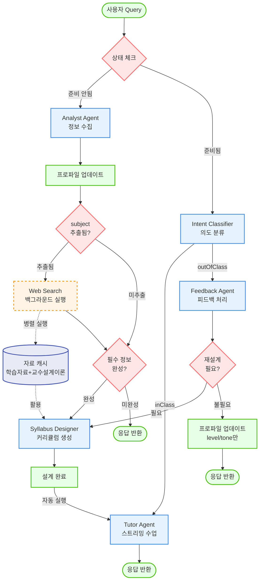

# System Flowchart

## ADDIE 모델 기반 적응형 학습 튜터 시스템 흐름도



## 주요 특징

### 백그라운드 Web Search (새로 추가)
- **실행 시점**: Analyst Agent가 `subject`(학습 주제)를 추출하는 즉시
- **병렬 처리**: 사용자 응답과 병렬로 실행되어 대기 시간 최소화
- **수집 데이터**:
  - 학습 자료 (관련 문서, 튜토리얼 등)
  - 적합한 교수설계이론 (주제별 최적 교수법)
- **활용**: Syllabus Designer가 커리큘럼 생성 시 캐시된 자료 활용

### 노드 타입 설명
- 🔴 **빨간 다이아몬드**: 의사결정 노드 (조건 분기)
- 🔵 **파란 사각형**: 프로세스 노드 (Agent 실행)
- 🟢 **초록 둥근 사각형**: 상태 노드 (입력/출력/상태 변경)
- 🟠 **주황 점선 사각형**: 백그라운드 프로세스 (비동기)
- 🟣 **보라 원통**: 캐시/저장소 (데이터 저장)

### 화살표 타입
- **실선 화살표** (→): 일반적인 동기 흐름
- **점선 화살표** (-.->): 백그라운드/비동기 흐름
```