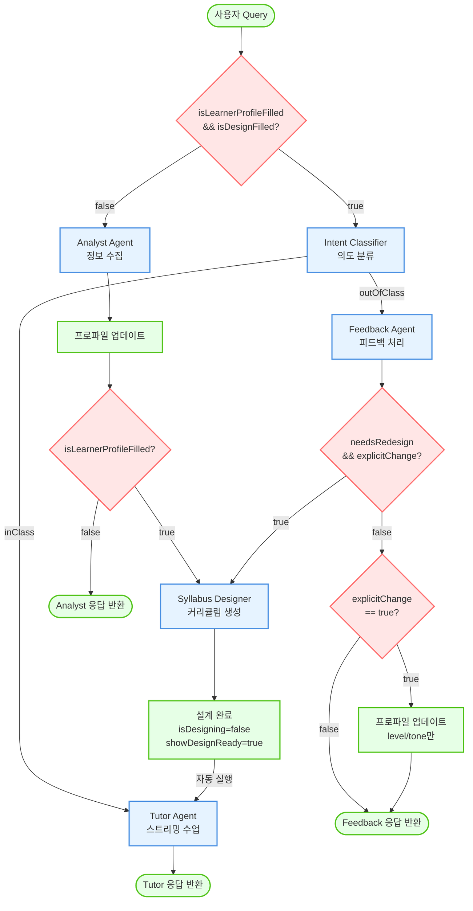
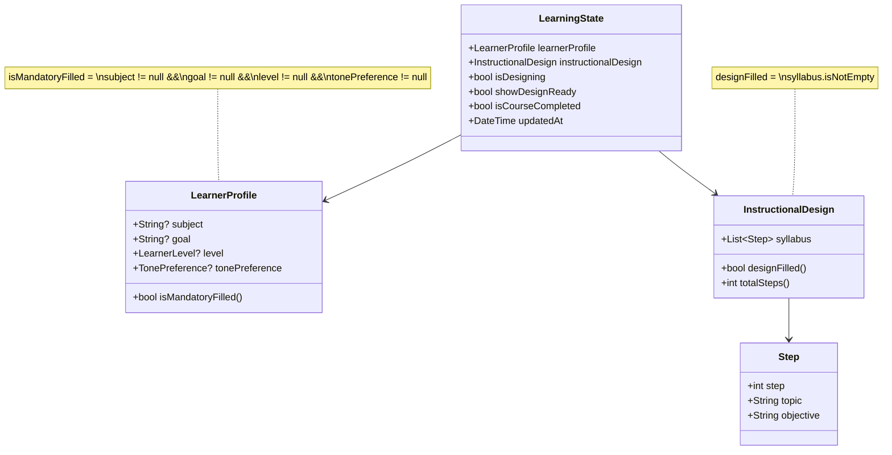
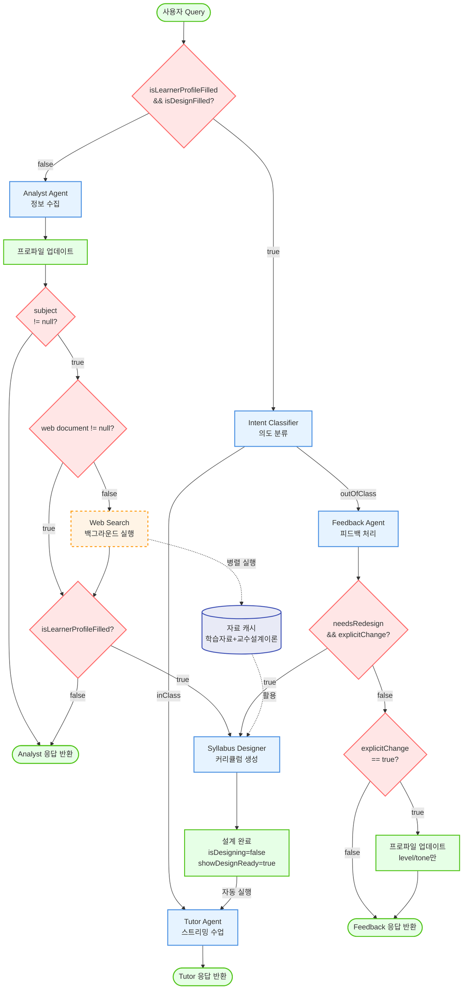
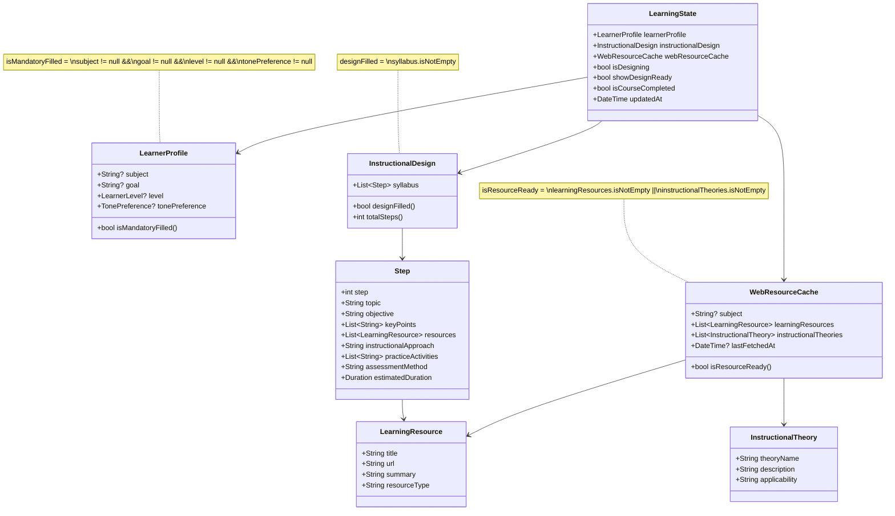

# System Flowchart

## ADDIE 모델 기반 적응형 학습 튜터 시스템 흐름도

### 현재 버전 (v1.0 - Web Search 없음)



---

## State 구조 및 조건 플래그 (v1.0)



### 조건 플래그 계산 로직

| 플래그 | 조건식 | 위치 | 의미 |
|--------|--------|------|------|
| **isLearnerProfileFilled** | `subject != null && goal != null && level != null && tonePreference != null` | [learner_profile.dart:35](lib/models/learner_profile.dart#L35) | 학습자 프로필 4가지 필수 정보 모두 완성 |
| **isDesignFilled** | `syllabus.isNotEmpty` | [instructional_design.dart:48](lib/models/instructional_design.dart#L48) | 커리큘럼(Syllabus) 생성 완료 |
| **isDesigning** | 수동 설정 | [learning_state.dart:7](lib/models/learning_state.dart#L7) | 커리큘럼 생성 중 (중복 방지용) |
| **showDesignReady** | 수동 설정 | [learning_state.dart:8](lib/models/learning_state.dart#L8) | 설계 완료 UI 표시 플래그 |
| **isCourseCompleted** | 수동 설정 | [learning_state.dart:9](lib/models/learning_state.dart#L9) | 학습 완료 여부 (새 학습 시작 판단용) |

### State 변화 예시

```
초기 상태:
  subject=null, goal=null, level=null, tone=null, syllabus=[]
  → isLearnerProfileFilled=false, isDesignFilled=false

턴1: "Python 배우고 싶어요"
  subject=Python, goal=null, level=null, tone=null
  → isLearnerProfileFilled=false (goal, level, tone 누락)

턴2: "웹 개발하고 싶어요. 쉽게 설명해주세요"
  subject=Python, goal=웹개발, level=beginner, tone=null
  → isLearnerProfileFilled=false (tone 누락)

턴3: "친절하게요"
  subject=Python, goal=웹개발, level=beginner, tone=kind
  → isLearnerProfileFilled=true ✅
  → 커리큘럼 생성 시작 (isDesigning=true)

턴4: (커리큘럼 생성 완료)
  syllabus=[Step1, Step2, Step3, ...]
  → isDesignFilled=true ✅
  → isDesigning=false, showDesignReady=true
  → 수업 시작 가능!
```

---

### 향후 버전 (v2.0 - Web Search 추가 예정)



---

## State 구조 및 조건 플래그 (v2.0 - Web Search 추가)



### 조건 플래그 계산 로직 (v2.0)

| 플래그 | 조건식 | 의미 |
|--------|--------|------|
| **isLearnerProfileFilled** | `subject != null && goal != null && level != null && tonePreference != null` | 학습자 프로필 4가지 필수 정보 모두 완성 |
| **isDesignFilled** | `syllabus.isNotEmpty` | 커리큘럼(Syllabus) 생성 완료 |
| **isResourceReady** | `learningResources.isNotEmpty || instructionalTheories.isNotEmpty` | 웹 검색 자료 수집 완료 |
| **isDesigning** | 수동 설정 | 커리큘럼 생성 중 (중복 방지용) |
| **showDesignReady** | 수동 설정 | 설계 완료 UI 표시 플래그 |
| **isCourseCompleted** | 수동 설정 | 학습 완료 여부 (새 학습 시작 판단용) |

### 새로 추가되는 필드 설명

#### WebResourceCache
```dart
class WebResourceCache {
  final String? subject;                          // 검색한 주제
  final List<LearningResource> learningResources; // 수집된 학습 자료
  final List<InstructionalTheory> instructionalTheories; // 적합한 교수설계이론
  final DateTime? lastFetchedAt;                  // 마지막 검색 시간

  bool get isResourceReady =>
    learningResources.isNotEmpty || instructionalTheories.isNotEmpty;
}
```

#### LearningResource (학습 자료)
```dart
class LearningResource {
  final String title;        // 자료 제목
  final String url;          // 자료 URL
  final String summary;      // 자료 요약
  final String resourceType; // 자료 유형 (documentation, tutorial, article, video)
}
```

#### InstructionalTheory (교수설계이론)
```dart
class InstructionalTheory {
  final String theoryName;   // 이론 이름 (예: Scaffolding, Mastery Learning)
  final String description;  // 이론 설명
  final String applicability; // 해당 주제에 적용 가능한 이유
}
```

#### Step (학습 단계) - v2.0 개선
```dart
class Step {
  final int step;                            // 단계 번호
  final String topic;                        // 주제
  final String objective;                    // 학습 목표

  // v2.0에서 추가되는 필드들
  final List<String> keyPoints;              // 핵심 학습 포인트
  final List<LearningResource> resources;    // 이 단계에 필요한 학습 자료
  final String instructionalApproach;        // 적용할 교수법 (교수설계이론 활용)
  final List<String> practiceActivities;     // 실습/연습 활동
  final String assessmentMethod;             // 평가 방법
  final Duration estimatedDuration;          // 예상 학습 시간
}
```

**v1.0 vs v2.0 비교:**

| 항목 | v1.0 | v2.0 |
|------|------|------|
| **기본 정보** | topic, objective | topic, objective |
| **학습 내용** | ❌ | keyPoints (핵심 포인트) |
| **학습 자료** | ❌ | resources (단계별 자료) |
| **교수법** | ❌ | instructionalApproach (이론 적용) |
| **실습** | ❌ | practiceActivities (활동 목록) |
| **평가** | ❌ | assessmentMethod (평가 방법) |
| **시간** | ❌ | estimatedDuration (예상 시간) |

### State 변화 예시 (v2.0)

```
초기 상태:
  subject=null, goal=null, level=null, tone=null, syllabus=[]
  webResourceCache.learningResources=[], webResourceCache.instructionalTheories=[]
  → isLearnerProfileFilled=false, isDesignFilled=false, isResourceReady=false

턴1: "Python 배우고 싶어요"
  subject=Python, goal=null, level=null, tone=null
  → 백그라운드 Web Search 시작 (병렬 실행)
  → isLearnerProfileFilled=false (goal, level, tone 누락)

턴1-백그라운드: Web Search 완료
  webResourceCache.subject=Python
  webResourceCache.learningResources=[
    {title: "Python 공식 문서", url: "...", ...},
    {title: "초보자를 위한 Python", url: "...", ...}
  ]
  webResourceCache.instructionalTheories=[
    {theoryName: "Scaffolding", description: "...", ...}
  ]
  → isResourceReady=true ✅

턴2: "웹 개발하고 싶어요. 쉽게 설명해주세요"
  subject=Python, goal=웹개발, level=beginner, tone=null
  → isLearnerProfileFilled=false (tone 누락)

턴3: "친절하게요"
  subject=Python, goal=웹개발, level=beginner, tone=kind
  → isLearnerProfileFilled=true ✅
  → 커리큘럼 생성 시작 (webResourceCache 활용)

턴4: (커리큘럼 생성 완료 - 웹 자료 활용)
  syllabus=[
    Step {
      step: 1,
      topic: "Python 기초",
      objective: "변수와 데이터 타입 이해하기",
      keyPoints: [
        "변수 선언과 할당 방법",
        "int, float, str, bool 타입 이해",
        "타입 변환 (type casting)"
      ],
      resources: [
        LearningResource("Python 공식 문서 - 변수", "https://...", ...),
        LearningResource("초보자를 위한 Python 변수 설명", "https://...", ...)
      ],
      instructionalApproach: "Scaffolding: 간단한 예제부터 점진적 확장",
      practiceActivities: [
        "자신의 이름과 나이를 저장하는 변수 만들기",
        "숫자 타입 간 연산 실습"
      ],
      assessmentMethod: "실습 코드 작성 및 결과 확인",
      estimatedDuration: Duration(minutes: 30)
    },
    Step {
      step: 2,
      topic: "제어문",
      objective: "조건문과 반복문 활용하기",
      keyPoints: [...],
      resources: [...],
      instructionalApproach: "Mastery Learning: 충분한 연습 후 다음 단계",
      ...
    },
    ...
  ]
  → isDesignFilled=true ✅
  → 수업 시작 가능! (각 단계마다 자료/활동/평가 준비 완료)
```

---

## 의사결정 노드 상세 설명

### 1. `isMandatoryFilled && designFilled?`
- **위치**: [chat_provider.dart:245-246](lib/providers/chat_provider.dart#L245-L246)
- **로직**: `learning.learnerProfile.isMandatoryFilled && learning.instructionalDesign.designFilled`
- **조건**:
  - `isMandatoryFilled`: `subject != null && goal != null`
  - `designFilled`: `syllabus.isNotEmpty`
- **true**: 수업 가능 상태 → Intent 분류
- **false**: 정보 수집 필요 → Analyst Flow

### 2. `subject != null?`
- **위치**: [chat_provider.dart:378-379](lib/providers/chat_provider.dart#L378-L379) (Analyst Flow 내부)
- **로직**: `result.subject != null` (이번 턴에 subject가 추출되었는지)
- **목적**: 주제 추출 시 웹 검색 트리거 (향후 구현)
- **true**: 백그라운드 Web Search 실행 (병렬) → 필수 정보 체크로 이동
- **false**: subject 추출 안됨 → 필수 정보 체크로 이동

### 3. `subject && goal && level && tone?`
- **위치**: [chat_provider.dart:396-400](lib/providers/chat_provider.dart#L396-L400) (Analyst Flow 내부)
- **로직**: `updated.learnerProfile.isMandatoryFilled && !updated.instructionalDesign.designFilled && (forceAnalyst || !wasMandatory)`
- **실제 조건**: [learner_profile.dart:35](lib/models/learner_profile.dart#L35)
  ```dart
  isMandatoryFilled = subject != null && goal != null && level != null && tonePreference != null
  ```
- **목적**: 4가지 필수 정보 모두 완성 시 커리큘럼 생성 시작
- **true**: 모든 정보 완성 → Syllabus Designer 시작
- **false**: 하나라도 누락 → Analyst 응답 반환 (누락 정보 요청)
- **예시**:
  - subject=Python, goal=null → false → "어떤 목표가 있으신가요?"
  - subject=Python, goal=웹개발, level=null → false → "현재 수준이 어떻게 되시나요?"
  - subject=Python, goal=웹개발, level=beginner, tone=null → false → "어떤 말투를 선호하시나요?"
  - subject=Python, goal=웹개발, level=beginner, tone=kind → true → 커리큘럼 생성

### 4. Intent Classifier 분류
- **위치**: [chat_provider.dart:253-258](lib/providers/chat_provider.dart#L253-L258)
- **서비스**: `IntentClassifierService.classify()`
- **로직**: 이전 튜터 메시지와 현재 사용자 발화를 분석
- **inClass**: 수업 내 발화 → Tutor Flow (스트리밍)
- **outOfClass**: 수업 외 발화 → Feedback Flow

### 5. `needsRedesign && explicitChange?`
- **위치**: [chat_provider.dart:585](lib/providers/chat_provider.dart#L585) (Feedback Flow 내부)
- **로직**: `result.needsRedesign && result.explicitChange`
- **조건**:
  - `needsRedesign`: 재설계가 필요한지 Feedback Agent가 판단
  - `explicitChange`: 명시적 변경 요청인지 (추측 방지)
- **true**: 커리큘럼 재생성
- **false**: 명시적 변경 체크로 이동
- **오판 케이스**: `needsRedesign=true && explicitChange=false`는 LLM 오판으로 간주하여 무시 ([chat_provider.dart:602-605](lib/providers/chat_provider.dart#L602-L605))
  - 예: "이거 너무 어려운데요?" → LLM이 재설계 필요하다고 착각할 수 있음

### 6. `explicitChange == true?`
- **위치**: [chat_provider.dart:573](lib/providers/chat_provider.dart#L573) (Feedback Flow 내부)
- **로직**: `result.explicitChange`
- **목적**: 명시적 변경 요청만 프로파일 업데이트 (추측 방지)
- **true**: level/tone 업데이트 후 Feedback 응답 반환
- **false**: 잡담/감정 표현으로 간주, Feedback 응답만 반환
- **예시**:
  - "쉽게 설명해주세요" → explicitChange=true → level 변경
  - "고마워요!" → explicitChange=false → 응답만 반환

---

## 응답 주체 및 특징

### 응답 반환 노드별 주체

| 노드 | Agent | 응답 방식 | 위치 | 예시 |
|------|-------|----------|------|------|
| **Response1** | Analyst | JSON 추출 (비스트리밍) | [chat_provider.dart:359](lib/providers/chat_provider.dart#L359) | "Python을 배우고 싶으시군요! 구체적으로 어떤 목표가 있으신가요?" |
| **Response2** | Tutor | 스트리밍 | [chat_provider.dart:471-486](lib/providers/chat_provider.dart#L471-L486) | "좋아요! 변수는 데이터를 저장하는 상자예요..." |
| **Response3** | Feedback | JSON 추출 (비스트리밍) | [chat_provider.dart:562](lib/providers/chat_provider.dart#L562) | "알겠어요. 난이도를 낮춰서 설명할게요." |

### Feedback Agent의 3가지 역할

#### 1. 난이도/말투 변경 처리
```
사용자: "너무 어려워요. 쉽게 설명해주세요."
→ explicitChange: true
→ level: expert → beginner
→ 응답: "알겠어요. 좀 더 쉽게 설명할게요."
```

#### 2. 재설계 요청 감지 및 위임
```
사용자: "순서를 바꿔주세요. 변수를 먼저 배우고 싶어요."
→ needsRedesign: true
→ explicitChange: true
→ redesignRequest: "변수를 먼저 배우고 싶다"
→ Syllabus Designer에 재설계 위임
```

#### 3. 잡담 필터링 (무시)
```
사용자: "고마워요!" / "재밌네요!"
→ explicitChange: false
→ needsRedesign: false
→ 응답만 반환: "천만에요! 계속 진행해볼까요?"
```

---

## 주요 특징

### 백그라운드 Web Search (새로 추가 예정)
- **실행 시점**: Analyst Agent가 `subject`(학습 주제)를 추출하는 즉시
- **병렬 처리**: 사용자 응답과 병렬로 실행되어 대기 시간 최소화
- **수집 데이터**:
  - 학습 자료 (관련 문서, 튜토리얼 등)
  - 적합한 교수설계이론 (주제별 최적 교수법)
- **활용**: Syllabus Designer가 커리큘럼 생성 시 캐시된 자료 활용

### 노드 타입 설명
- 🔴 **빨간 다이아몬드**: 의사결정 노드 (조건 분기)
- 🔵 **파란 사각형**: 프로세스 노드 (Agent 실행)
- 🟢 **초록 둥근 사각형**: 상태 노드 (입력/출력/상태 변경)
- 🟠 **주황 점선 사각형**: 백그라운드 프로세스 (비동기)
- 🟣 **보라 원통**: 캐시/저장소 (데이터 저장)

### 화살표 타입
- **실선 화살표** (→): 일반적인 동기 흐름
- **점선 화살표** (-.->): 백그라운드/비동기 흐름
