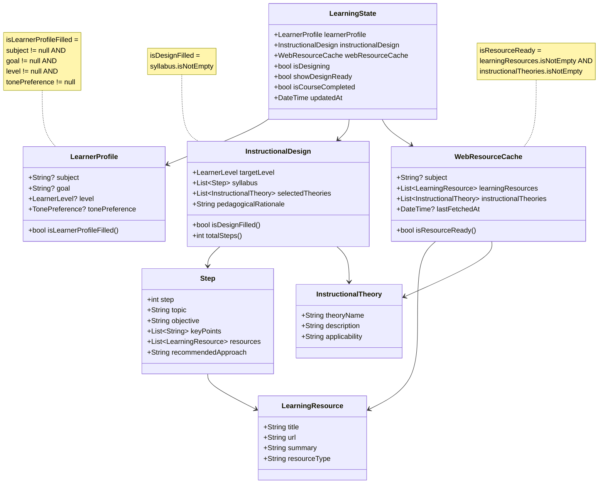

# System Flowchart

## ADDIE 모델 기반 적응형 학습 튜터 시스템 흐름도

### 현재 버전 (v1.0 - Web Search 없음)

```mermaid
flowchart TD
    Start([사용자 Query]) --> ReadyCheck{isLearnerProfileFilled<br/>AND isDesignFilled?}

    %% 준비 안됨 경로
    ReadyCheck -->|false| Analyst[Analyst Agent<br/>정보 수집]
    Analyst --> ProfileUpdate[LearnerProfile 업데이트]
    ProfileUpdate --> MandatoryCheck{isLearnerProfileFilled?}
    MandatoryCheck -->|true| DesignStart[Syllabus Designer<br/>커리큘럼 생성]
    MandatoryCheck -->|false| Response1([Analyst 응답 반환])

    %% 준비됨 경로
    ReadyCheck -->|true| IntentClassifier[Intent Classifier<br/>의도 분류]

    IntentClassifier -->|inClass| Tutor[Tutor Agent<br/>스트리밍 수업]
    Tutor --> Response2([Tutor 응답 반환])

    IntentClassifier -->|outOfClass| Feedback[Feedback Agent<br/>피드백 처리]
    Feedback --> RedesignCheck{needsRedesign<br/>AND explicitChange?}
    RedesignCheck -->|true| DesignStart
    RedesignCheck -->|false| ExplicitCheck{explicitChange<br/>== true?}
    ExplicitCheck -->|true| ProfileUpdate2["LearnerProfile 업데이트<br/>(level/tone만)"]
    ExplicitCheck -->|false| Response3([Feedback 응답 반환])
    ProfileUpdate2 --> Response3

    %% 설계 완료 후 자동 수업 시작
    DesignStart --> DesignComplete[InstructionalDesign 업데이트]
    DesignComplete -->|자동 실행| Tutor

    %% 스타일링
    classDef decisionStyle fill:#FFE6E6,stroke:#FF6B6B,stroke-width:2px
    classDef processStyle fill:#E6F3FF,stroke:#4A90E2,stroke-width:2px
    classDef stateStyle fill:#E6FFE6,stroke:#52C41A,stroke-width:2px

    class ReadyCheck,MandatoryCheck,RedesignCheck,ExplicitCheck decisionStyle
    class Analyst,IntentClassifier,Tutor,Feedback,DesignStart processStyle
    class Start,Response1,Response2,Response3,ProfileUpdate,ProfileUpdate2,DesignComplete stateStyle
```



---

## State 구조 및 조건 플래그 (v1.0)


### 조건 플래그 계산 로직

| 플래그 | 조건식 | 위치 | 의미 |
|--------|--------|------|------|
| **isLearnerProfileFilled** | `subject != null && goal != null && level != null && tonePreference != null` | [learner_profile.dart:35](lib/models/learner_profile.dart#L35) | 학습자 프로필 4가지 필수 정보 모두 완성 |
| **isDesignFilled** | `syllabus.isNotEmpty` | [instructional_design.dart:48](lib/models/instructional_design.dart#L48) | 커리큘럼(Syllabus) 생성 완료 |
| **isDesigning** | 수동 설정, true일 경우에 입력창 disabled | [learning_state.dart:7](lib/models/learning_state.dart#L7) | 커리큘럼 생성 중 (중복 방지용) |
| **showDesignReady** | 수동 설정 | [learning_state.dart:8](lib/models/learning_state.dart#L8) | 설계 완료 UI 표시 플래그 |
| **isCourseCompleted** | 수동 설정 | [learning_state.dart:9](lib/models/learning_state.dart#L9) | 학습 완료 여부 (새 학습 시작 판단용) |

---

### 향후 버전 (v2.0 - Web Search 추가 예정)

```mermaid
flowchart TD
    Start([사용자 Query]) --> ReadyCheck{isLearnerProfileFilled<br/>AND isDesignFilled?}

    %% 준비 안됨 경로
    ReadyCheck -->|false| Analyst[Analyst Agent<br/>정보 수집]
    Analyst --> ProfileUpdate[LearnerProfile 업데이트]

    %% 백그라운드 Web Search (subject 추출 시)
    ProfileUpdate --> SubjectCheck{subject<br/>!= null?}
    SubjectCheck -->|true| DataCheck{isResourceReady?}
    DataCheck ---|false| WebSearch["Web Search<br/>(백그라운드 실행)"]
    DataCheck -->|true| MandatoryCheck
    SubjectCheck -->|false| Response1([Analyst 응답 반환])
    WebSearch -.-> ResourceCache[(WebResourceCache)]
    WebSearch --> MandatoryCheck

    MandatoryCheck{isLearnerProfileFilled?}
    MandatoryCheck -->|true| DesignStart[Syllabus Designer<br/>커리큘럼 생성]
    MandatoryCheck -->|false| Response1

    %% 준비됨 경로
    ReadyCheck -->|true| IntentClassifier[Intent Classifier<br/>의도 분류]

    IntentClassifier -->|inClass| Tutor[Tutor Agent<br/>스트리밍 수업]
    Tutor --> Response2([Tutor 응답 반환])

    IntentClassifier -->|outOfClass| Feedback[Feedback Agent<br/>피드백 처리]
    Feedback --> RedesignCheck{needsRedesign<br/>AND explicitChange?}
    RedesignCheck -->|true| DesignStart
    RedesignCheck -->|false| ExplicitCheck{explicitChange<br/>== true?}
    ExplicitCheck -->|true| ProfileUpdate2["LearnerProfile 업데이트<br/>(tone만)"]
    ExplicitCheck -->|false| Response3([Feedback 응답 반환])
    ProfileUpdate2 --> Response3

    %% 설계 시 캐시 활용
    ResourceCache --> DesignStart

    %% 설계 완료 후 자동 수업 시작
    DesignStart --> DesignComplete[InstructionalDesign 업데이트]
    DesignComplete -->|자동 실행| Tutor

    %% 스타일링
    classDef decisionStyle fill:#FFE6E6,stroke:#FF6B6B,stroke-width:2px
    classDef processStyle fill:#E6F3FF,stroke:#4A90E2,stroke-width:2px
    classDef stateStyle fill:#E6FFE6,stroke:#52C41A,stroke-width:2px
    classDef backgroundStyle fill:#FFF4E6,stroke:#FF9800,stroke-width:2px,stroke-dasharray: 5 5
    classDef cacheStyle fill:#E8EAF6,stroke:#3F51B5,stroke-width:2px

    class ReadyCheck,MandatoryCheck,RedesignCheck,DataCheck,SubjectCheck,ExplicitCheck decisionStyle
    class Analyst,IntentClassifier,Tutor,Feedback,DesignStart processStyle
    class Start,Response1,Response2,Response3,ProfileUpdate,ProfileUpdate2,DesignComplete stateStyle
    class WebSearch backgroundStyle
    class ResourceCache cacheStyle
```



---

## State 구조 및 조건 플래그 (v2.0 - Web Search 추가)



### 조건 플래그 계산 로직 (v2.0)

| 플래그 | 조건식 | 의미 |
|--------|--------|------|
| **isLearnerProfileFilled** | `subject != null && goal != null && level != null && tonePreference != null` | 학습자 프로필 4가지 필수 정보 모두 완성 |
| **isDesignFilled** | `syllabus.isNotEmpty` | 커리큘럼(Syllabus) 생성 완료 |
| **isResourceReady** | `learningResources.isNotEmpty && instructionalTheories.isNotEmpty` | 웹 검색 자료 수집 완료 |
| **isDesigning** | 수동 설정, true일 경우에 입력창 disabled | 커리큘럼 생성 중 (중복 방지용) |
| **showDesignReady** | 수동 설정 | 설계 완료 UI 표시 플래그 |
| **isCourseCompleted** | 수동 설정 | 학습 완료 여부 (새 학습 시작 판단용) |

### 새로 추가되는 필드 설명

#### WebResourceCache
```dart
class WebResourceCache {
  final String? subject;                          // 검색한 주제
  final List<LearningResource> learningResources; // 수집된 학습 자료
  final List<InstructionalTheory> instructionalTheories; // 적합한 교수설계이론
  final DateTime? lastFetchedAt;                  // 마지막 검색 시간

  bool get isResourceReady =>
    learningResources.isNotEmpty && instructionalTheories.isNotEmpty;
}
```

#### LearningResource (학습 자료)
```dart
class LearningResource {
  final String title;        // 자료 제목
  final String url;          // 자료 URL
  final String summary;      // 자료 요약
  final String resourceType; // 자료 유형 (documentation, tutorial, article, video)
}
```

#### InstructionalTheory (교수설계이론)
```dart
class InstructionalTheory {
  final String theoryName;   // 이론 이름 (예: Scaffolding, Mastery Learning)
  final String description;  // 이론 설명
  final String applicability; // 해당 주제에 적용 가능한 이유
}
```

#### InstructionalDesign (교수설계) - v2.0 개선
```dart
class InstructionalDesign {
  final LearnerLevel targetLevel;                       // 이 커리큘럼의 대상 level
  final List<Step> syllabus;                            // 학습 단계들
  final List<InstructionalTheory> selectedTheories;     // 선택되고 적용된 교수설계 이론
  final String pedagogicalRationale;                    // 왜 이 이론들을 선택했는지

  bool get isDesignFilled => syllabus.isNotEmpty;
  int get totalSteps => syllabus.length;
}
```

#### Step (학습 단계) - v2.0 개선
```dart
class Step {
  final int step;                            // 단계 번호
  final String topic;                        // 주제
  final String objective;                    // 학습 목표 (targetLevel에 맞게 설정됨)

  // v2.0에서 추가되는 필드들
  final List<String> keyPoints;              // 핵심 학습 포인트 (targetLevel에 맞는 깊이)
  final List<LearningResource> resources;    // 이 단계에 필요한 학습 자료
  final String recommendedApproach;          // 이 단계에 권장되는 교수법
                                             // 예: "Scaffolding - 이전 단계 복습 후 새 개념 도입"
}
```

#### 역할 분리: Syllabus Designer vs Tutor Agent

**Syllabus Designer의 역할 (설계):**
1. `subject` + `goal` + `level` 분석
2. `WebResourceCache`에서 교수설계 이론 후보 조회
3. `targetLevel`에 맞는 교수설계 이론 선택 → `selectedTheories`
4. 선택한 이론에 기반하여 커리큘럼 설계
5. 각 `Step`에 `recommendedApproach` 명시

**Tutor Agent의 역할 (실행):**
- **입력 정보**:
  - `InstructionalDesign.selectedTheories`: 적용된 교수설계 이론
  - `Step.recommendedApproach`: 단계별 권장 교수법
  - `LearnerProfile.tonePreference`: 전달 스타일만
- **동작**: 설계된 교수법대로 실행, 임의 판단 없음
- **tone만 조정**: 같은 내용을 어떤 말투로 전달할지

**이 접근의 장점:**
1. **명확한 책임 분리**: Designer는 설계, Tutor는 실행만
2. **일관성**: 수업 중 교수법이 임의로 바뀌지 않음
3. **Token 효율**: Tutor는 `WebResourceCache` 접근 불필요, `InstructionalDesign`만 참조
4. **Stateless 원칙**: LLM은 생성만, 판단은 Designer가

---

## 의사결정 노드 상세 설명

### 1. `isLearnerProfileFilled && isDesignFilled?`
- **위치**: [chat_provider.dart:245-246](lib/providers/chat_provider.dart#L245-L246)
- **로직**: `learning.learnerProfile.isLearnerProfileFilled && learning.instructionalDesign.isDesignFilled`
- **조건**:
  - `isLearnerProfileFilled`: `subject != null && goal != null && level != null && tonePreference != null`
  - `isDesignFilled`: `syllabus.isNotEmpty`
- **true**: 수업 가능 상태 → Intent 분류
- **false**: 정보 수집 필요 → Analyst Flow

### 2. `subject != null?`
- **위치**: [chat_provider.dart:378-379](lib/providers/chat_provider.dart#L378-L379) (Analyst Flow 내부)
- **로직**: `result.subject != null` (이번 턴에 subject가 추출되었는지)
- **목적**: 주제 추출 시 웹 검색 트리거 (향후 구현)
- **true**: 백그라운드 Web Search 실행 (병렬) → 필수 정보 체크로 이동
- **false**: subject 추출 안됨 → 필수 정보 체크로 이동

### 3. `isLearnerProfileFilled?`
- **위치**: [chat_provider.dart:396-400](lib/providers/chat_provider.dart#L396-L400) (Analyst Flow 내부)
- **로직**: `updated.learnerProfile.isLearnerProfileFilled && !updated.instructionalDesign.isDesignFilled && (forceAnalyst || !wasMandatory)`
- **실제 조건**: [learner_profile.dart:35](lib/models/learner_profile.dart#L35)
  ```dart
  isLearnerProfileFilled = subject != null && goal != null && level != null && tonePreference != null
  ```
- **목적**: 4가지 필수 정보 모두 완성 시 커리큘럼 생성 시작
- **true**: 모든 정보 완성 → Syllabus Designer 시작
- **false**: 하나라도 누락 → Analyst 응답 반환 (누락 정보 요청)
- **예시**:
  - subject=Python, goal=null → false → "어떤 목표가 있으신가요?"
  - subject=Python, goal=웹개발, level=null → false → "현재 수준이 어떻게 되시나요?"
  - subject=Python, goal=웹개발, level=beginner, tone=null → false → "어떤 말투를 선호하시나요?"
  - subject=Python, goal=웹개발, level=beginner, tone=kind → true → 커리큘럼 생성

### 4. Intent Classifier 분류
- **위치**: [chat_provider.dart:253-258](lib/providers/chat_provider.dart#L253-L258)
- **서비스**: `IntentClassifierService.classify()`
- **로직**: 이전 튜터 메시지와 현재 사용자 발화를 분석
- **inClass**: 수업 내 발화 → Tutor Flow (스트리밍)
- **outOfClass**: 수업 외 발화 → Feedback Flow

### 5. `needsRedesign && explicitChange?`
- **위치**: [chat_provider.dart:585](lib/providers/chat_provider.dart#L585) (Feedback Flow 내부)
- **로직**: `result.needsRedesign && result.explicitChange`
- **조건**:
  - `needsRedesign`: **subject/goal/level 변경**으로 재설계가 필요한지 Feedback Agent가 판단
  - `explicitChange`: 명시적 변경 요청인지 (추측 방지)
- **true**: 커리큘럼 재생성
- **false**: 명시적 변경 체크로 이동
- **재설계 대상**:
  - **v1.0**: subject, goal 변경
  - **v2.0**: subject, goal, **level** 변경
    - subject 변경: "Python → JavaScript로 바꿔주세요"
    - goal 변경: "웹개발 → 데이터분석으로 바꿔주세요"
    - level 변경: "초보자 수준으로 다시 설명해주세요" (커리큘럼 순서/깊이 변경 필요)
    - 순서 변경: "변수를 먼저 배우고 싶어요"
- **재설계 제외**:
  - tone 변경: Tutor가 실시간 반영 (말투만 변경, 커리큘럼 무관)
- **오판 케이스**: `needsRedesign=true && explicitChange=false`는 LLM 오판으로 간주하여 무시 ([chat_provider.dart:602-605](lib/providers/chat_provider.dart#L602-L605))
  - 예: "이거 너무 어려운데요?" → LLM이 재설계 필요하다고 착각할 수 있음

### 6. `explicitChange == true?`
- **위치**: [chat_provider.dart:573](lib/providers/chat_provider.dart#L573) (Feedback Flow 내부)
- **로직**: `result.explicitChange`
- **목적**: 명시적 변경 요청만 프로파일 업데이트 (추측 방지)
- **true**: **tone 업데이트** 후 Feedback 응답 반환 (재설계 없음)
- **false**: 잡담/감정 표현으로 간주, Feedback 응답만 반환
- **v2.0에서의 처리**:
  - tone만 변경: LearnerProfile 업데이트, Tutor가 다음 턴부터 새 tone으로 수업
  - level 변경: `needsRedesign`으로 처리 (재설계 필요)
- **예시**:
  - "격식있게 말해주세요" → explicitChange=true, needsRedesign=false → tone 변경 → ProfileUpdate2
  - "초보자 수준으로 바꿔주세요" → explicitChange=true, needsRedesign=true → level 변경 → 재설계
  - "고마워요!" → explicitChange=false → 응답만 반환

---

## 응답 주체 및 특징

### 응답 반환 노드별 주체

| 노드 | Agent | 응답 방식 | 위치 | 예시 |
|------|-------|----------|------|------|
| **Response1** | Analyst | JSON 추출 (비스트리밍) | [chat_provider.dart:359](lib/providers/chat_provider.dart#L359) | "Python을 배우고 싶으시군요! 구체적으로 어떤 목표가 있으신가요?" |
| **Response2** | Tutor | 스트리밍 | [chat_provider.dart:471-486](lib/providers/chat_provider.dart#L471-L486) | "좋아요! 변수는 데이터를 저장하는 상자예요..." |
| **Response3** | Feedback | JSON 추출 (비스트리밍) | [chat_provider.dart:562](lib/providers/chat_provider.dart#L562) | "알겠어요. 난이도를 낮춰서 설명할게요." |

### Feedback Agent의 3가지 역할

#### 1. 말투 변경 처리 (v2.0)
```
사용자: "격식있게 말해주세요."
→ explicitChange: true
→ needsRedesign: false
→ tone: kind → formal
→ 응답: "알겠습니다. 격식있게 말씀드리겠습니다."
```

#### 2. 재설계 요청 감지 및 위임
```
v1.0 - subject/goal 변경:
사용자: "순서를 바꿔주세요. 변수를 먼저 배우고 싶어요."
→ needsRedesign: true
→ explicitChange: true
→ Syllabus Designer에 재설계 위임

v2.0 - subject/goal/level 변경:
사용자: "초보자 수준으로 다시 가르쳐주세요."
→ needsRedesign: true (커리큘럼 순서/깊이 변경 필요)
→ explicitChange: true
→ level: intermediate → beginner
→ Syllabus Designer에 재설계 위임
```

#### 3. 잡담 필터링 (무시)
```
사용자: "고마워요!" / "재밌네요!"
→ explicitChange: false
→ needsRedesign: false
→ 응답만 반환: "천만에요! 계속 진행해볼까요?"
```

---

## 주요 특징

### 백그라운드 Web Search (새로 추가 예정)
- **실행 시점**: Analyst Agent가 `subject`(학습 주제)를 추출하는 즉시
- **병렬 처리**: 사용자 응답과 병렬로 실행되어 대기 시간 최소화
- **수집 데이터**:
  - 학습 자료 (관련 문서, 튜토리얼 등)
  - 적합한 교수설계이론 (주제별 최적 교수법)
- **활용**: Syllabus Designer가 커리큘럼 생성 시 캐시된 자료 활용

### 노드 타입 설명
- 🔴 **빨간 다이아몬드**: 의사결정 노드 (조건 분기)
- 🔵 **파란 사각형**: 프로세스 노드 (Agent 실행)
- 🟢 **초록 둥근 사각형**: 상태 노드 (입력/출력/상태 변경)
- 🟠 **주황 점선 사각형**: 백그라운드 프로세스 (비동기)
- 🟣 **보라 원통**: 캐시/저장소 (데이터 저장)

### 화살표 타입
- **실선 화살표** (→): 일반적인 동기 흐름
- **점선 화살표** (-.->): 백그라운드/비동기 흐름
